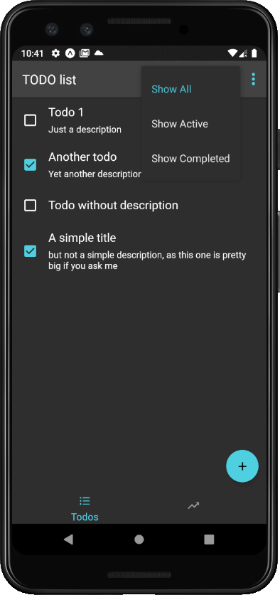
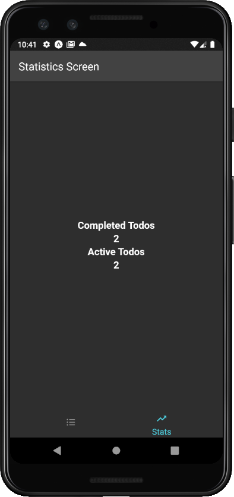
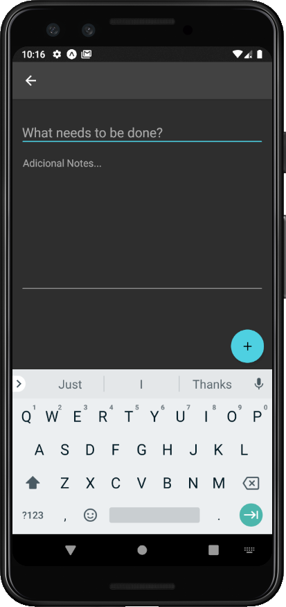
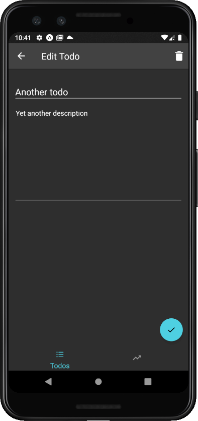

## TODO LIST APP
This project is a simple TODO app created in order to complete the challenge [here](https://github.com/brianegan/flutter_architecture_samples/blob/master/app_spec.md). It is just me learning React Native.

## Features

You can add, remove, edit and list all TODOs. You can set a TODO as completed. There's also two menu overlays with options for marking all complete, clearing them, show all, show only active TODOs and show all completed. There's also a screen that shows how many TODOs are active and how many are completed.    

## Screenshots

The two screenshots below show the TODO list with one of the overflow menus active and the statistics screen: 

;
;

And the next two show how the Add and Edit screens look like:

;
;

## Installation

First, you need to have installed [Expo](https://expo.io/) and a package manager such as Yarn or NPM. After downloading the project, install the dependencies with:

`yarn install` or `npm install`

Run the code with: 

`yarn start` or `npm start`

Finally you can scan the Qrcode provided by the expo-cli or have an emulator up and running.
